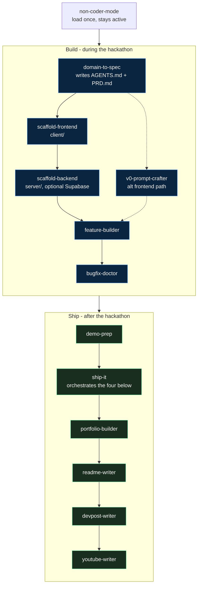

<div align="center">

# The Hackathon Playbook

### Win your next hackathon: battle-tested strategies, plus an AI skill pipeline that builds and ships the project for you.

<a href="https://thehackathonplaybook.dev"></a>
<a href="https://thehackathonplaybook.dev/playbook"></a>
<a href="https://thehackathonplaybook.dev/non-coders"></a>
<a href="https://thehackathonplaybook.dev/blog"></a>

<br />


<br /><br />


<br /><br />

<p>
  <a href="#what-this-is">What this is</a>
  &nbsp;&middot;&nbsp;
  <a href="#agent-skills-pipeline">Skill pipeline</a>
  &nbsp;&middot;&nbsp;
  <a href="#tech-stack">Tech stack</a>
  &nbsp;&middot;&nbsp;
  <a href="#quick-start">Quick start</a>
  &nbsp;&middot;&nbsp;
  <a href="#about-the-author">Author</a>
</p>

</div>

## What this is

The Hackathon Playbook is two things in one repo:

1. **The site** at [thehackathonplaybook.dev](https://thehackathonplaybook.dev): a content-heavy, SEO-first guide to winning hackathons. A fixed seven-phase playbook, a track for non-coders, and a keyword-targeted blog, distilled from 50+ events and $100K+ in prizes.
2. **The skill pipeline** under [`skills/`](./skills): installable AI agent skills that take a new hackathon project from idea to spec to scaffold to demo, then package it for recruiters. These run *against your project repo*, not against this site.

The guidance and the tooling share one opinion about how hackathons are actually won, so the advice on the site and the skills in the repo point in the same direction.

> [!NOTE]
> The site is the product. The skills are a toolkit you install into your *own* project. Editing this repo changes the playbook site; running a skill scaffolds or ships a different repo.

## Agent skills pipeline

The skills are designed to run in order for a new project. Build during the hackathon, then ship after it.



### Build

| Skill | What it does |
| :-- | :-- |
| **`non-coder-mode`** | Communication and safety guardrails for non-coders. Load once at the start of the session; it stays active. |
| **`domain-to-spec`** | Interviews you, then writes `AGENTS.md` and `PRD.md` to the project root. Every scaffold skill refuses to run without these. |
| **`scaffold-frontend`** | Reads `PRD.md` and creates `client/` with a Next.js app whose pages match the spec. |
| **`scaffold-backend`** | Reads `PRD.md`. If a backend is needed, creates `server/` with FastAPI routes and optional Supabase. Skipped otherwise. |
| **`v0-prompt-crafter`** | Alternative to `scaffold-frontend`: turns the PRD into a copy-paste [Vercel v0](https://v0.dev) prompt. Use one or the other, not both. |
| **`feature-builder`** | Plans, implements, and verifies one feature at a time in small reversible steps. |
| **`bugfix-doctor`** | Reproduce, isolate, fix, verify. Use it whenever something breaks. |
| **`prompt-master`** | Generates optimized prompts for any AI tool (LLMs, Cursor, image and video models, coding agents). |
| **`quickstart`** | Shortcut that chains `domain-to-spec` to `scaffold-frontend` to `scaffold-backend` behind one confirmation gate. |

### Ship

| Skill | What it does |
| :-- | :-- |
| **`demo-prep`** | A timed presentation script, click path, backup plan, rehearsal checklist, and judge Q&A. |
| **`ship-it`** | Interviews once, then runs the four packaging skills below in order so they tell one consistent story. |
| **`portfolio-builder`** | A distinctive, recruiter-facing portfolio site for the project (uses Anthropic's `frontend-design` skill). |
| **`readme-writer`** | A winner-grade GitHub README, plus the repo's About metadata. |
| **`devpost-writer`** | The full Devpost submission: tagline, story sections, Built With tags, and links. |
| **`youtube-writer`** | The demo video's title and description, tuned for recruiters and search. |

**`blog-writer`** sits outside the loop. It publishes write-ups to *this* site using the rich blog blocks.

## Tech stack

| Layer | Choice |
| :-- | :-- |
| Framework | [Next.js 16](https://nextjs.org/) (App Router, React 19, TypeScript) |
| Styling | [Tailwind CSS v4](https://tailwindcss.com/) + [shadcn/ui](https://ui.shadcn.com/) (new-york, CSS variables) over radix-ui |
| Icons | lucide-react |
| Analytics | [Vercel Analytics](https://vercel.com/docs/analytics) (Web Vitals) + [PostHog](https://posthog.com/) (events, blog engagement) |
| Fonts | JetBrains Mono (display), Outfit (body), Fira Code (code) via `next/font/google` |
| Hosting | [Vercel](https://vercel.com/) |

## Quick start

```bash
pnpm install
cp .env.example .env.local   # optional: PostHog key, Beehiiv newsletter keys, base URL
pnpm run dev                 # http://localhost:3000
```

```bash
pnpm run build               # verification gate for content/page changes
pnpm run lint
pnpm test                    # unit tests (vitest); integration tests run in CI against next start
pnpm gen                     # rebuild + regenerate all agent-facing artifacts (markdown corpus, llms.txt, skills, index)
```

> [!TIP]
> The package manager is **pnpm**. Both lockfiles exist in the repo; use pnpm.

<details>
<summary><b>Repository layout</b></summary>

```text
app/
  layout.tsx              # Root layout (fonts, dark mode, metadata, JSON-LD)
  globals.css             # Full design system (colors, animations, effects)
  page.tsx                # Home page with FAQ + HowTo schema
  sitemap.ts              # Dynamic XML sitemap
  robots.ts               # robots.txt
  playbook/               # 7-phase hackathon playbook
  non-coders/             # Non-coder guides and installable AI skills
  blog/                   # SEO blog with keyword-targeted articles
  api/newsletter/         # Beehiiv signup route
components/
  ui/                     # shadcn/ui components (auto-themed)
  blog-blocks.tsx         # Rich blog content blocks
  blog-analytics.tsx      # Blog engagement tracking (scroll depth, reading time)
  json-ld.tsx             # JSON-LD structured data
lib/
  playbook.ts             # Playbook section definitions (fixed 7-phase order)
  non-coder-sections.ts   # Non-coder section definitions
  non-coder-skills.ts     # Installable AI skill definitions
  blog.ts, blog/          # Blog posts (one file per post) and shared types
skills/                   # The agent skill pipeline (see above)
docs/                     # SEO, analytics, content conventions, engagement research
```

</details>

The site is **data-driven**: content lives in typed TypeScript under `lib/`, and route templates render it. To add content you usually edit a data file, not a page. The full project guidance lives in [`CLAUDE.md`](./CLAUDE.md) (and [`AGENTS.md`](./AGENTS.md), which points to it).

## AI and agent access

The site is machine-readable by design: every content page has a Markdown twin (append `.md`, or send `Accept: text/markdown`), an [llms.txt](https://thehackathonplaybook.dev/llms.txt) index, agent discovery documents under `/.well-known/` (MCP server card, agent-skills index with digests, api-catalog), a public read-only [MCP server](./docs/mcp.md) at `/api/mcp`, and a retrieval-grounded chatbot that answers only from site content. All of it is generated from the same sources that render the pages and gated by CI freshness checks. See [`docs/agent-readiness.md`](./docs/agent-readiness.md) for the architecture, [`docs/cloudflare-config.md`](./docs/cloudflare-config.md) for the dashboard settings it depends on, and the public [/ai](https://thehackathonplaybook.dev/ai) page for the user-facing summary.

## SEO and analytics

- **SEO**: dynamic sitemap, `robots.txt`, JSON-LD structured data (WebSite, Organization, FAQPage, HowTo, Article, BreadcrumbList), keyword-optimized metadata, Open Graph and Twitter cards, and canonical URLs. See [`docs/seo-implementation.md`](./docs/seo-implementation.md).
- **Analytics**: Vercel Analytics for Web Vitals, plus optional PostHog for events and blog engagement (scroll depth, reading time, completion). PostHog is gated on `NEXT_PUBLIC_POSTHOG_KEY`. See [`docs/analytics-setup.md`](./docs/analytics-setup.md).

## About the author

**Bill Zhang** ([@IdkwhatImD0ing](https://github.com/IdkwhatImD0ing)) is one of the most decorated hackathon competitors in the US college scene. The playbook is what he learned doing it.

- **36+ wins** across 50+ hackathons attended, **$100K+** in total prizes
- **First place at 1,000+ person events**: HackUTD (largest 24hr hackathon in the US), UC Berkeley AI Hackathon (largest AI hackathon in the US), LA Hacks
- **Google Developer Student Challenge** Top 10 Global Finalist (only US team in the top 10 across three years)
- Co-founder of [WeCracked](https://wecracked.com/), a 4,000+ member hackathon community
- Co-founder of Dispatch AI, an AI-powered 911 system funded by Berkeley SkyDeck
- Applied AI Engineer at [Scale AI](https://scale.com/); USC MS in Computer Science (AI), UCSC undergrad

| Hackathon | Result | Project | Year |
| :-- | :-- | :-- | :-- |
| HackUTD 2024 | 1st Place Grand Prize + Goldman Sachs | TalkTuahBank | 2024 |
| UC Berkeley AI Hackathon | Grand Prize + AI for Good + Intel 1st ($60K+) | Dispatch AI | 2024 |
| LA Hacks 2024 | 1st Place Google Challenge | AdaptED | 2024 |
| VTHacks 12 | Best Startup Award | Linguify | 2024 |
| Google Developer Student Challenge | Top 10 Global (2,000+ teams) | SlugLoop | 2023 |

**Links:** [Portfolio](https://v2.art3m1s.me/) &middot; [GitHub](https://github.com/IdkwhatImD0ing) &middot; [LinkedIn](https://www.linkedin.com/in/bill-zhang1/) &middot; [Devpost](https://devpost.com/IdkwhatImD0ing)

<div align="center">

<br />

**[The Hackathon Playbook](https://thehackathonplaybook.dev)** &middot; built by [@IdkwhatImD0ing](https://github.com/IdkwhatImD0ing)

<a href="#the-hackathon-playbook">↑ back to top</a>

</div>
